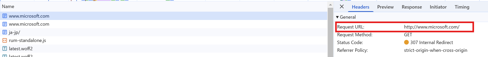
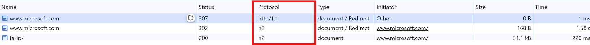

いつもお世話になっております。Azure Networking チームの庄です。

Application Gateway の HTTP/2 の動作について、v1 と v2 の SKU によって動作が異なるため、v1 から v2 に移行する際に困る方がいらっしゃるかと思います。そこで、以下にその動作の違いについてご説明いたします。

# HTTP 2 とは
HTTP/2（Hypertext Transfer Protocol version 2）は、ウェブ ページのデータをウェブサーバーから取得するための新しい通信方法です。
HTTP/1.1 の後継として、2015年に正式な仕様として承認されました。HTTP/2には、「h2」と「h2c」の二つの識別子があり、それぞれの識別子は、HTTP/2 接続を確立する際に利用するプロトコルが異なります。

・識別子が"h2"となっている場合、それは HTTP/2 通信がトランスポート層セキュリティ（TLS）を使用するプロトコルであることを示しています。

・識別子が"h2c"となっている場合、それは HTTP/2 通信が TLS を使用しないことを示し、HTTP/2 通信は HTTP アップグレードメカニズムのアップグレードヘッダーと HTTP2-Settings ヘッダーフィールドで使用されるトークンとして使用されていました。

[HTTP/2 の関連記事 (英語)](https://datatracker.ietf.org/doc/html/rfc9113#known-http)

> The "h2c" string was previously used as a token for use in the HTTP Upgrade mechanism's Upgrade header field. This usage was never widely deployed and is deprecated by this document. The same applies to the HTTP2-Settings header field, which was used with the upgrade to "h2c".


Chrome や Edge など現在主要なブラウザでは、HTTP/2 Over TLS のみが HTTP/2 として使用できます。
 

www.yahoo.co.jp に HTTP 通信を送信する際には、ブラウザが HTTP/2 Over TCP (h2c) が非サポートのため、Http/2 接続が確立せず、HTTP/1.1 で接続を確立します。

 
 

なお、ブラウザからのアクセスではなく、curl コマンドや HTTP クライアントなど別のアプリから HTTP リクエストを送信する際には、HTTP/2 Over TCP を利用して HTTP/2 通信が行われる可能性があります。この状況では、Application Gateway が送信先となる際に、v1 と v2 で動作が異なります。v1 の場合、HTTP/2 通信はダウングレードされて、v2 の場合は HTTP ステータスコード 403 が応答されます。詳細の動作つきましては、以下のセッションをご参照ください。

# Application Gateway において、HTTP2 のサポートにつきまして
Application Gateway というリバース プロキシ サービスは、フロントエンド接続（クライアント - Application Gateway）とバックエンド接続（Application Gateway - バックエンドサーバー）の二つの接続が発生します。現在、バックエンド接続における HTTP/2 はサポートされておりません。

フロントエンド接続における HTTP/2 のサポート状況については、リスナーを利用しているプロトコルによって異なります。詳細は以下のテーブルをご参照いただけますと幸いです。

|リスナーのプロトコル | サポート状況 |
| ------------ | ------------ |
| HTTPS | サポート |
| HTTP  | 非サポート | 

一般的なシナリオとして、HTTP/2 Over TLS が使用されるため、Application Gateway の観点からは、お客様独自のシステム状況を把握していないため、一般的に HTTP/2 Over TLS のみを考慮しております。そのため、Application Gateway においても、HTTPS のリスナーにのみ HTTP/2 をサポートしております。HTTP のリスナーに HTTP/2 の通信は非サポートですが、実際の HTTP リスナーに HTTP/2 通信を送信する際には、SKU によって動作が異なります。


### V1 の動作
V1 の HTTP リスナーに HTTP/2 を用いて送信すると、通信がダウングレードされ、Application Gateway は HTTP/1.1 でレスポンスを送信します。

Curl コマンドでお試した結果
```
root:/# curl -v http://<v1 Appgw の IP> --http2
*   Trying xxxxxx:80...
* Connected to xxxx port 80 (#0)
> GET / HTTP/1.1
> Host: xxxxxx
> User-Agent: curl/7.81.0
> Accept: */*
> Connection: Upgrade, HTTP2-Settings
> Upgrade: h2c
> HTTP2-Settings: AAMAAABkAAQCAAAAAAIAAAAA
>
* Mark bundle as not supporting multiuse
< HTTP/1.1 200 OK
< Date: Wed, 25 Dec 2024 09:09:10 GMT
< Content-Type: text/html
< Content-Length: 7
< Connection: keep-alive
< Server: Microsoft-IIS/10.0

```
### V2 の動作
V2 の場合は、HTTP リスナーに Http/2 を送信すると、Application Gateway が 403 を応答します。

Curl コマンドでお試した結果
```
root: curl --http2 -v -k http://<v2 Appgw の IP>
*   Trying xxxx:80...
* Connected to xxxx (xxxx) port 80 (#0)
> GET / HTTP/1.1
> Host: xxxx
> User-Agent: curl/7.81.0
> Accept: */*
> Connection: Upgrade, HTTP2-Settings
> Upgrade: h2c
> HTTP2-Settings: AAMAAABkAAQCAAAAAAIAAAAA
>
* Mark bundle as not supporting multiuse
< HTTP/1.1 403 Forbidden
< Server: Microsoft-Azure-Application-Gateway/v2
< Date: Wed, 25 Dec 2024 08:51:52 GMT
< Content-Type: text/html
< Content-Length: 179
< Connection: keep-alive
<
<html>
<head><title>403 Forbidden</title></head>
<body>
<center><h1>403 Forbidden</h1></center>
<hr><center>Microsoft-Azure-Application-Gateway/v2</center>
</body>
</html>
* Connection #0 to host xxxx left intact

```

ログから確認すると、HTTP リスナーに HTTP/2 を送信すると、アクセスログの「httpStatus」に 403 が記載され、「serverStatus」には別のステータスコードが記載される事象が発生しています。こちらは不具合ではなく、想定された動作ですのでご安心ください。

また、このブロックはコードレベルでの動作であり、WAF を利用していない Standard v2 の Application Gateway でも同様の動作をします。つまり、WAF を利用していなくても、Application Gateway v2 は HTTP リスナーで受け取った HTTP/2 通信をブロックします。
  
  


