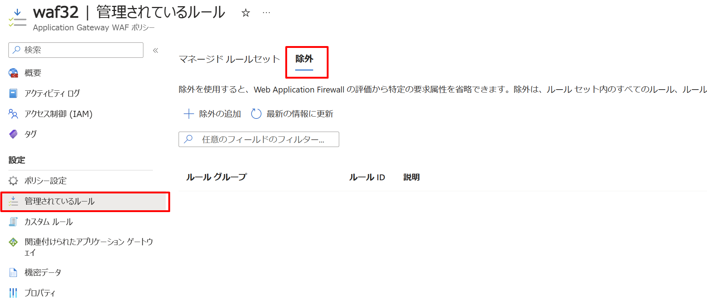
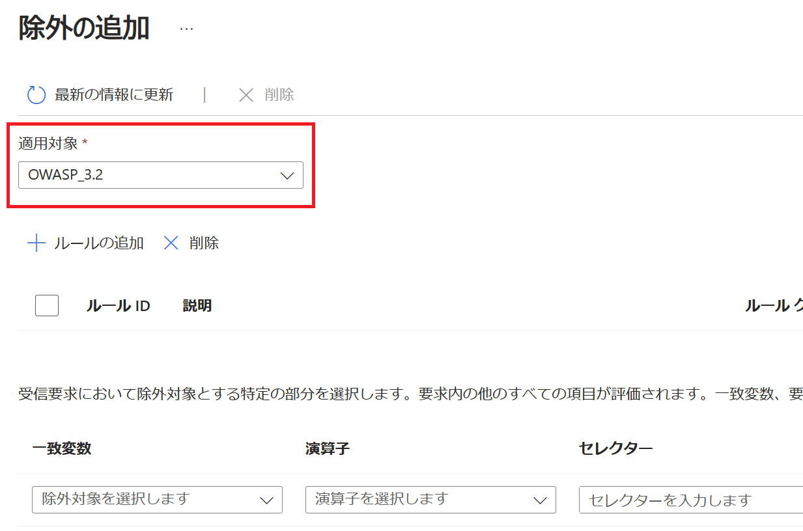

<p>いつもお世話になっております。Azure Netチームの庄です。
<p>Application GatewayのWAFを使用する際に、本来許可されるべき通信がブロックされる事例がしばしば発生します。このような誤検知が発生した場合に、お客様自身がどのように初期対応を行うことができるかについて、以下で説明します

# 誤検知が発生する際に対応方法
<p>WAF で誤検知が発生する主な原因は、Request Body や ヘッダー 内に攻撃と誤判断される文字列が存在するため、WAF によって通信がブロックされます。この問題に対処する方法として、WAF の除外設定、カスタムルールの利用、ルールの無効化などを活用して特定の条件下での WAF の評価を回避するか、またはアプリケーション側での修正を行うこととなります。

## WAF側の設定<br />
<p>Azure WAF の設定を使って誤検知を避ける方法には、主に3つの方法があります。

### 設定方法１：除外を利用する
<p>除外は、特定のヘッダーや Request Body 内で誤検知が起こった部分を指定し、これらを誤検知として検出されたルールの評価から外す方法です。この方法は、本セッションに紹介した 3 つの中で最も安全性が高いと考えられます。除外の設定は、WAF ポリシーの「管理されているルール」のページで見つけることができます。



### 設定方法２：カスタムルールを利用する
<p>カスタムルールを使用することで、特定の IP アドレスからの通信や特定のパスへのアクセスを WAF の評価から除外し、通信を WAF の評価から”Bypass”するルールを作成できます。カスタムルールはマネージドルールよりも優先され、ここで設定したルールによって通信が許可または拒否されます。カスタムルールの設定は、WAF ポリシーの「カスタムルール」ページで行うことができます。

### 設定方法３：特定のルールの無効化
<p>WAF で特定のルールによる誤検知が発生した場合、そのルールを無効にすることも誤検知への対処法の一つです。ルールの無効化は、WAFポリシーの「管理されているルール」ページで行うことができます。


> [!NOTE]
> これらの方法以外にも、WAF の要求本文の検査を無効にすることが考えられますが、これを行うと WAF がリクエストボディの検査を行わなくなり、セキュリティリスクが高まる可能性があります。このオプションを検討する場合は、サーバー側でのセキュリティ対策の実施をお勧めします。

## アプリ側の対応

<p> WAF 側の設定だけでは要件を満たさない場合、アプリケーション側での対策が解決策の一つになります。例えば、ユーザー情報をフォームで収集するアプリケーションを開発する際に、フォーム入力で「#」や「%」のような、攻撃に利用される可能性のある文字の使用を制限する設定を追加することで、ユーザーがこれらの文字を含むリクエストを送信することによる誤検知を防ぐことができます。

# ログ

<p>誤検知が発生した場合、その原因を理解することが最初のステップです。具体的には、どのルールによって誤検知が起きているのか、そしてその誤検知の原因が何なのかを WAF のログから把握する必要があります。この情報がなければ、誤検知を避けるための適切な対策を講じることができません。WAF のログは、WAF に関連付けられた Application Gateway のログで以下のクエリを実行することで確認できます。

```CMD
AzureDiagnostics 
| where ResourceProvider == "MICROSOFT.NETWORK" and Category == "ApplicationGatewayFirewallLog"
```
<p>上記のクエリ以外にも、以下のドキュメントには様々なWAFログのクエリ例が記載されています。

[Log Analytics を使用して Application Gateway Web アプリケーション ファイアウォール (WAF) のログを調べる](https://learn.microsoft.com/ja-jp/azure/application-gateway/log-analytics)

## WAF ログのフィールド
誤検知に対応するためには、以下の WAF ログのフィールドを理解する必要があります。

### フィールド１：ruleSetType & ruleSetVersion
<p>ruleSetType と ruleSetVersion は、特定の通信がどのルールセット内のどのルールに一致しているか表示されます。特に WAF ポリシーに複数のバージョンのルールセットが設定されている場合、正しいバージョンのルールセットに対して除外を作成する必要がありので、こちらのフィールドの参照が必要です。

### フィールド２：ruleId
<p>ruleId は、特定の通信がどのルールに一致しているかを示します。OWASP 3.2 以上の WAF ポリシーを利用する際には、こちらのフィールドの参照して、除外を作成するときに正しいルールを選択する必要があります。

### フィールド３： details_data
<p>ルールにマッチした原因は、WAF ログの details_data で確認できます。通常、以下の形式でマッチした内容を確認できます。


#### 上図 ① の部分について
① は、通常、マッチした文字列です。例えば、Request Body に「#」が含まれているためにルールによって検出された場合、①には「#」が表示されます。

#### 上図 ② の部分について
② は、通常、Request Body のどの部分にマッチする文字列が含まれているかを示します。例えば、あるヘッダー名に「#」が含まれている場合、② には「HeaderName」が表示されます。② に表示されるものはマッチしたルールの種類（OWASP や Bot Manager Ruleなど）によって異なることがあります。

#### 上図 ③ の部分について
<p> ③ は、② の内容と関連しています。② が特定の名前「xxxName」を示している場合、③ではその具体的な変数名が表示されます。例えば、ヘッダー名に不正な文字「#」が含まれてWAFによって検出された場合、③ にはそのヘッダー名が表示されます。また、「XXX:YYYY」という形式で表示される場合もあります。これは、変数値に不正な文字列が検出された場合のログ表示形式です。

> [!NOTE]
> details_data に「Inbound Anomaly Score Exceeded」（受信異常スコア超過）というメッセージを記載する場合、実際の検出原因は同じ Transaction ID を持つ他のログで確認できます。詳細については、下記の異常スコアのドキュメントを参照していただければ幸いです
> [Web Application Firewall の DRS および CRS の規則グループと規則 ｜異常スコアリング](https://learn.microsoft.com/ja-jp/azure/web-application-firewall/ag/application-gateway-crs-rulegroups-rules?tabs=drs21#anomaly-scoring)
>

# 除外
除外を作成する際には、ログに検出された内容に基づいて除外を作成します。

## 設定フィールド：適用対象


<p> OWASP 3.2 以上の WAF ポリシーの除外設定では、ログの ruleSetType & ruleSetVersion フィールドに記載された内容に基づいて、適切なルールセットバージョンを選択する必要があります。例えば、誤検知が発生した際にruleSetType & ruleSetVersionが以下の値を表示している場合、適用対象として OWASP_3.2 を選択する必要があります。

|ruleSetType  |ruleSetVersion |
| ------------ | ------------ |
| OWASP CRS |3.2|

## 設定フィールド：ルールの追加


<p> OWASP 3.2 以上の WAF ポリシーを利用する際には、ログに記載された ruleId フィールドに基づき、除外を適用したい特定のルールを選択します。「ルールの追加」ボタンをクリックしてルール検索ページを開き、ログに表示された ruleId フィールドに記載されたルール ID を検索することで、除外を適用する対象となるルールを選び出せます。この操作により、特定のルールに対してのみ除外を適用でき、他のルールにマッチした場合は除外が適用されません。

## 一致変数


<p>一致変数の選択は、details_data 内の ② の値に基づいて行います。② の値と一致変数の対応表は以下の通りです。

|②の値  |一致変数の選択 |
| ------------ | ------------ |
| xxxKey|要求xxxキー|
| xxxName|要求xxx名|
| xxxValue|要求xxx値|
|Args|要求引数値|

## 演算子
<p> 演算子の選択には「次の値で始まる」、「次で終わる」、「次の値に等しい」、「次の値を含む」、「いずれかと等しい」といったオプションがあります。その中で特に注意が必要なオプションとして、「いずれかと等しい」を利用する場合、セレクターに設定される値に関わらず、「*」がセレクター値として適用されます。

## セレクター
セレクターでは、基本的は、details_data 内の ① の値に基づいて行いますが、セレクターを設定できないものがあります。

### セレクターに使用できるのは文字、数字、句読点のみです
<p>セレクターフィールドでは、文字、数字、句読点以外の入力が許可されていません。そのため、details_data 内の ① の値に特殊文字が含まれている場合、セレクターにその文字を直接設定することはできません。例えば、「Hea#der」という名前のヘッダーが WAF によって「#」の存在で検出された場合、① には「#」が表示されます。しかし、セレクター内では「#」の入力が許可されていないため、演算子として「次の値を含む」を選択し、セレクターには「Hea」や「der」といった値を選んで除外設定を行うことで、該当するヘッダーを除外することが可能です。

### 効果がない除外設定

details_data で検出された要求xxx値に基づいて除外を設定する際、WAF は特定の文字列を含む値に対して除外を適用できないため、以下のような除外設定では効果がありません。

 検知内容  |
| ------------ |
|   Matched Data: **#12** found within **ARGS** : **page**: **#1234** |

 効果がない除外の設定 |
| ------------ |
| 一致変数：要求引数値 |
| 演算子： 次の値に含む |
| セレクター： 12 or 34|

 効果がある除外の設定 |
| ------------ |
| 一致変数：要求引数値 |
| 演算子： 次の値に含む |
| セレクター： page|

 検知内容  |
| ------------ |
|   Matched Data: **#** found within **CookieValue** : **co**: **#aaaa** |

 効果がない除外の設定 |
| ------------ |
| 一致変数：要求引数値 |
| 演算子： 次の値に含む |
| セレクター： a or aa|

 効果がある除外の設定 |
| ------------ |
| 一致変数：要求引数値 |
| 演算子： 次の値に含む |
| セレクター： co|

効果がない除外の設定例と効果がある除外の設定例を比較して、どのように設定すれば効果的かを理解することが重要です。details_data に値で検出された場合、セレクターには検出された値が所在するフィールドの名前を入力することが推奨されます（例：Header値がマッチした場合は、セレクターにその Header 名を入力）。

<p>上記の例以外にも、以下のドキュメントには様々な除外例が記載されています。

[要求属性の例](https://learn.microsoft.com/ja-jp/azure/web-application-firewall/ag/application-gateway-waf-configuration?tabs=portal)


## カスタムルール

<p>カスタムルールを使用することで、特定のクエリストリングが含まれる URI、特定の IP アドレスからのアクセス、または特定のパスへのアクセスを許可することが可能です。これらのカスタムルールは、管理されたルールよりも高い優先順位を持ちます。カスタムルールで設定できるフィールドにつきましては、以下のドキュメントをご参照ください。

[Azure Application Gateway の Web アプリケーション ファイアウォール v2 カスタム規則](https://learn.microsoft.com/ja-jp/azure/web-application-firewall/ag/custom-waf-rules-overview)

## 特定のルールの無効化
WAF においては、個々のルールを無効化したり、ルールごとに特定のアクションを指定したりすることが可能です。ルールを無効化することで、WAF を介した通信がそのルールに基づいて評価されなくなります。ただし、管理されているルールの中には無効化ができないものも存在する点にはご注意ください。


